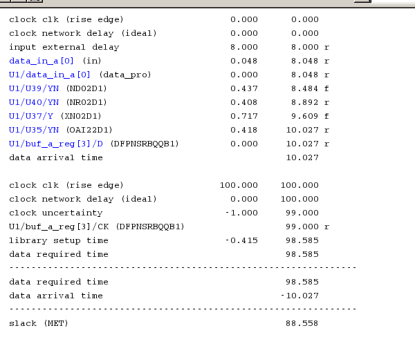
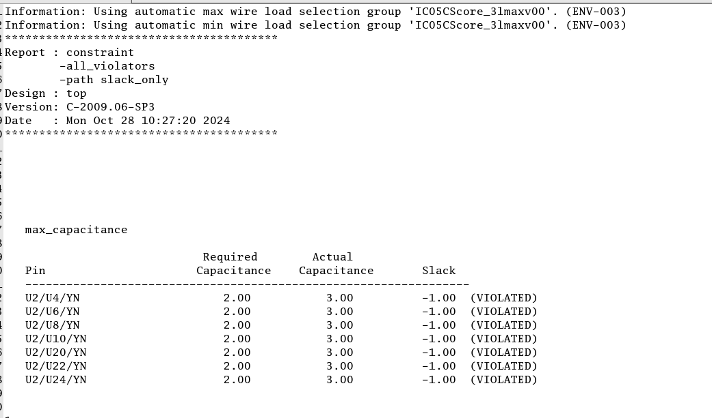
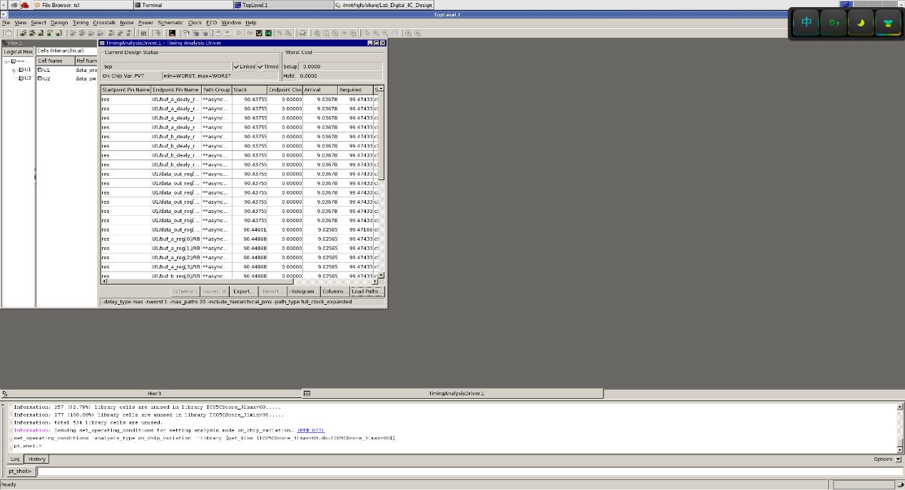
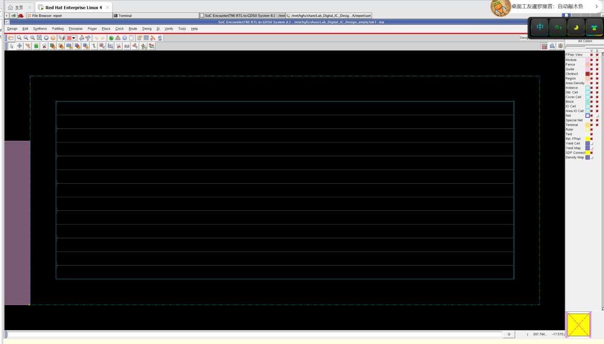
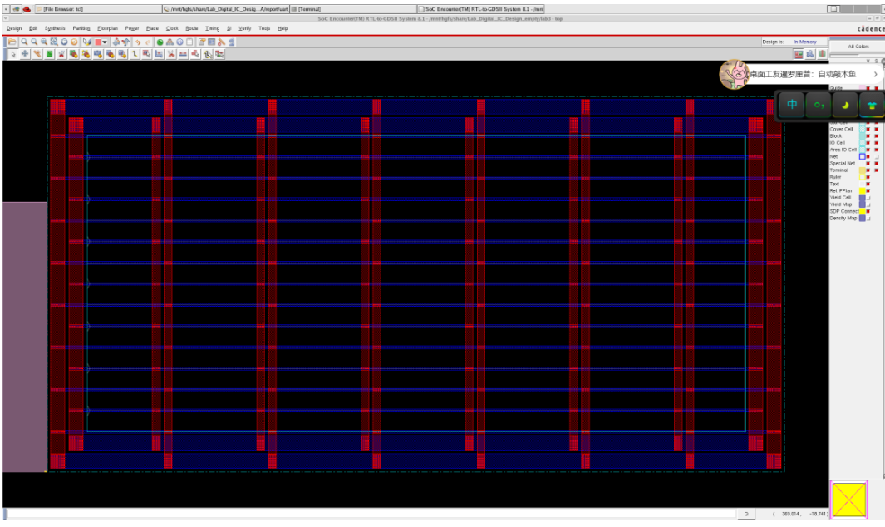
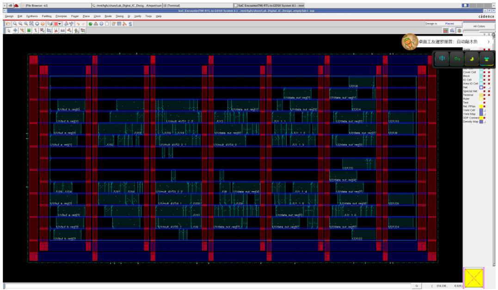
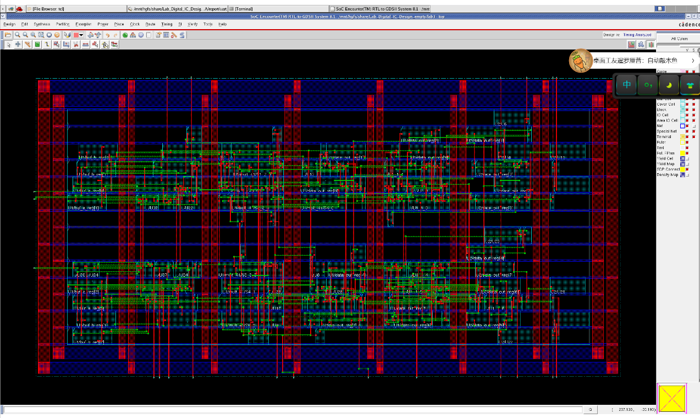
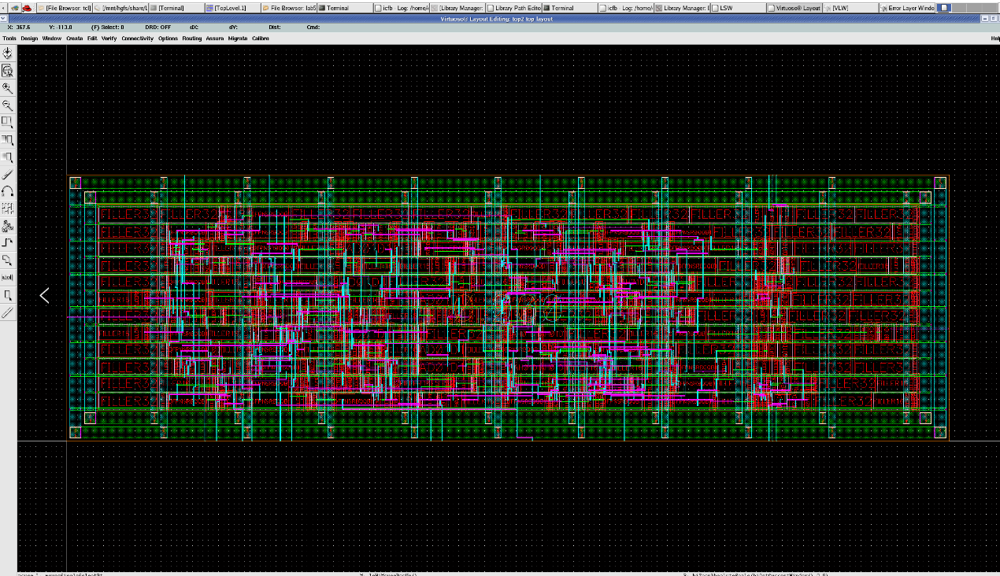
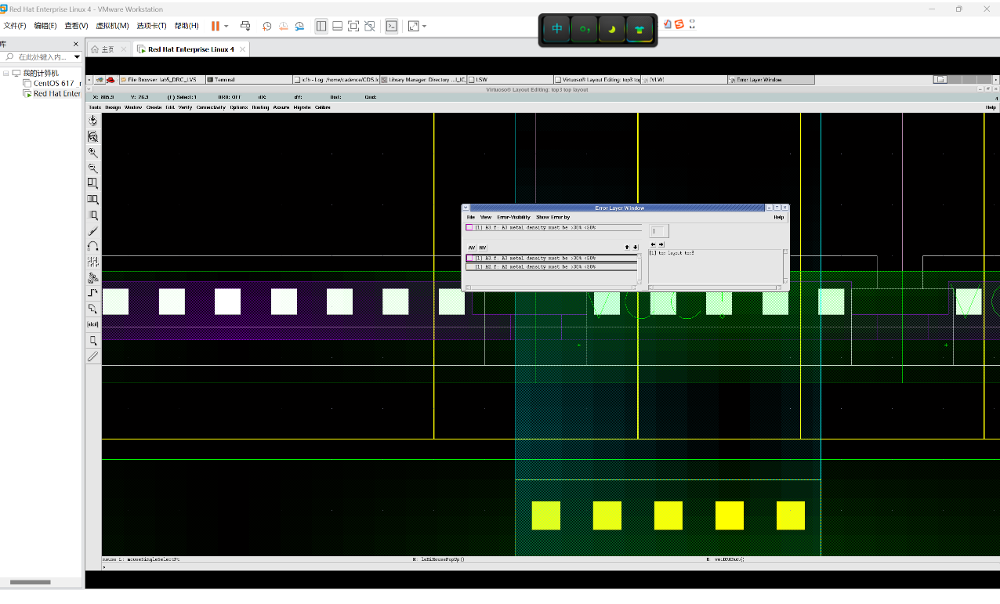
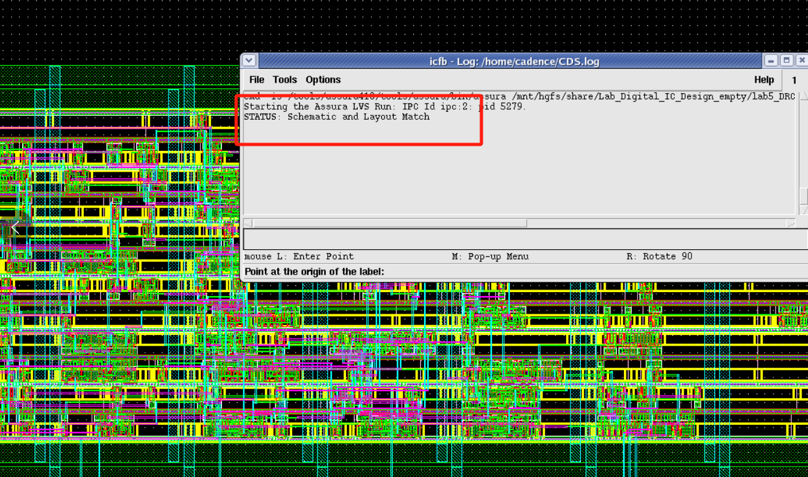

# Full-Flow Digital IC Design: From Verilog to GDSII
# 数字集成电路全流程设计：从 Verilog 到 GDSII

This repository showcases a complete digital ASIC design flow based on the **CSMC 0.5μm** process node. The project covers the entire implementation path from Verilog source code to physical layout verification.

本项目展示了基于 **上华 (CSMC) 0.5μm** 工艺节点的完整数字 ASIC 设计流程。涵盖了从 Verilog 源代码到物理版图验证的全过程实现。

---

## 👤 Author 信息
- **Name/姓名:** Keyu Li (李科瑜)
- **Supervised by/指导教师:** Jincheng Li (李金城)

---

## 🛠 EDA Tools & Tech Stack | 工具链与技术栈
| Phase / 阶段 | Tools / 工具 | Description / 描述 |
| :--- | :--- | :--- |
| **Logic Synthesis** | Synopsys Design Vision | RTL to Gate-level Netlist 逻辑综合 |
| **STA** | Synopsys PrimeTime | Timing Analysis & Verification 静态时序分析 |
| **P&R (Back-end)** | Cadence Encounter | Place and Route 自动布局布线 |
| **Physical Verification** | Cadence Virtuoso | DRC & LVS Check 物理验证 |
| **Process Node** | CSMC 0.5μm | Dual-Poly Three-Metal (DPTM) 工艺 |

---

## 🚀 Design Flow Overview | 设计流程概览

### 1. Logic Synthesis & Constraints (逻辑综合)
- **Module Structure:** `top.v` (Wrapper), `data_pro.v`, `data_sw.v`.
- **Target Frequency:** 10 MHz (Clock period = 100ns).
- **Result:** Converted RTL behavioral description into a technology-mapped gate-level netlist using specialized scripts.
- **结果:** 将 RTL 行为级描述转换为映射到工艺库的门级网表，通过脚本确保逻辑符合时序约束。
#### Synthesis Timing Report (Slack Analysis) | 综合时序报告

<i>Figure 1: Timing slack check under Worst Case conditions, confirming setup time compliance.</i>

### 2. Static Timing Analysis (静态时序分析)

- 在布局布线（Pre-Layout）前，利用 Synopsys PrimeTime (PT) 进行 Sign-off 级别的时序验证。
- Performed **Pre-layout STA** using PrimeTime with "Worst Case" library conditions.
- Validated setup and hold times to ensure zero violations before physical implementation.
- 使用 PrimeTime 在最差工况库下进行分析。验证建立时间和保持时间，确保在物理实现前无时序违例。

#### A. 时序余量分析 (Timing Slack Analysis)

在最差工况库（Worst-Case Corner）下，设计表现出极佳的时序收敛性。

- **Setup Slack**: ≈ 88.5 ns（周期 100 ns）
- **结论**：巨大的正余量（Positive Slack），为后续布局布线（P&R）中的绕线延迟留出了充足的 Margin。

  
  
<i>图 2: PT 详细路径报告 - 从输入端口到寄存器的完整时序路径</i>

#### B. 设计规则检查 (DRC - Max Capacitance)

通过 PT 检查电路的电气特性。报告显示在输出引脚存在 max_capacitance 违例。

- **现象**：实际负载 (3.0 fF) 超过了工艺库限制 (2.0 fF)。
- **分析**：这是由于在脚本中手动施加了过载压力测试（Stress Test）。此类违例将在 Layout 阶段通过插入高驱动能力的 IO Buffer 或调整走线负载来修复。

  
  
<i>图 3: 最大电容违例报告 - 体现了对输出驱动能力的严格监控</i>

#### C. STA 交互式验证 (Interactive GUI)

利用 PrimeTime GUI 监控整体时序状态，确保所有路径均已被正确约束。

  
  
<i>图 4: PrimeTime 交互界面 - Worst-Case 条件下的时序汇总</i>

### 3. Automatic Place and Route (自动布局布线)
- Managed floorplanning, power ring/stripe routing, and standard cell placement in Encounter.
- Generated the physical netlist and DEF files for layout extraction.
- 在 Encounter 中完成规划布线、电源环路设置及标准单元布局。生成物理网表及相关 DEF 文件用于版图提取。

#### A. Floorplanning & Core Definition

本项目使用 Cadence SoC Encounter（现更名为 Innovus）完成物理设计的顶层框架定义（Floorplanning）。

- **核心利用率 (Core Utilization)**：设置为 **0.6**（即 60%）。  
  对于本 UART_TX 设计，此利用率在芯片面积经济性与布线可行性之间取得了良好平衡：  
  - 提供了约 40% 的“白空间”（white space），为后续**时钟树综合 (CTS)**、**优化 (Optimization)** 和**全局/详细布线 (Routing)** 预留了足够的资源。  
  - 避免了过高利用率（>0.7）导致的拥塞（congestion）和 DRC 违例，同时也不会因过低利用率而浪费芯片面积。

- **核心到 IO 边距 (Core-to-IO Margin)**：四周统一预留 **30 μm**。  
  该间距主要用于构建**电源环 (Power Rings)** 和**电源轨 (Power Rails)**，确保：  
  - 电源从 IO pad 均匀、低阻抗地分配到核心逻辑区；  
  - 降低 IR-drop 和电源噪声；  
  - 满足工艺库对电源网络的最小宽度/间距要求。

  
  
<i>Figure 5: Initial Floorplan in SoC Encounter — 显示核心区域、标准单元行（Standard Cell Rows）、电源环预留空间及 IO 边距。</i>

完成 Floorplan 定义后，核心区域被清晰划分为规则的标准单元行（double-back rows），为后续自动放置（Placement）奠定基础。电源规划（Power Planning）将在下一步基于此框架展开。

#### B. Power Planning (电源规划)

电源规划的目标是在核心区域周围构建电源环（Power Rings）和电源连接，确保后续标准单元可直接获得 VDD 和 VSS 供电。这一步主要包括两个核心操作：**Add Rings**（添加电源环）和 **Add Stripes**（添加电源条），以及后续的全局网络连接和特殊布线。

##### Power Rings (电源环)

- 在 30μm 的边距内架设了 VDD 与 GND 环路。
- 设计准则：遵循 1mA/1μm 的电流密度约束。根据芯片峰值功耗估算电流，通过加宽金属线宽来消除电迁移（Electromigration）风险。
- 层规划：水平方向（H）采用 Metal3，垂直方向（V）采用 Metal2，形成低阻抗的网格结构。

执行后形成完整的 VDD/VSS 电源环。

##### Power Stripes (电源条带)：

- 在核心区域内部纵横交错排列金属条带，缩短电流传输路径。
- 目的：确保电流能够均匀分布到芯片中心位置，抑制局部 IR-Drop（电压降），防止因电压跌落导致的时序劣化。

##### Connect Global Nets（连接全局网络）

严格设置以下连接（名称小写 + 叹号）：
| 项目          | Connect to 设置值 | 说明                     |
|---------------|-------------------|--------------------------|
| vdd! Pin     | vdd!             | 电源引脚连接             |
| gnd! Pin     | gnd!             | 地引脚连接               |
| Tie High     | vdd!             | 高电平偏置单元连接到电源 |
| Tie Low      | gnd!             | 低电平偏置单元连接到地   |
| vdd! Net     | vdd!             | 电源网络连接             |
| gnd! Net     | gnd!             | 地网络连接               |

勾选 **Override prior connection** 和 **Verbose Output**，全部添加后点击 Apply。

此步确保逻辑网表与物理电源网络正确对应。

##### Special Route（特殊布线）

- 执行特殊布线命令，将标准单元行（Standard Cell Rows）的电源轨道（Rails）物理连接至主干电源环路。
- 这一步标志着芯片内部“供电线路”的全面贯通。

  
<i>Figure 6: Final PDN Result — 展示了电源环 (Ring)、条带 (Stripe) 以及通过 Special Route 连接的标准单元电源轨。</i>
 

完成电源规划后，核心区域供电网络已就绪，可进入标准单元放置阶段。

#### C. Standard Cell Placement & Pre-CTS Optimization

- **Placement**：自动将标准单元置入预定义的行（Rows）中，形成规则有序的布局结构。

  
  
<i>Figure 7: Standard Cells And Blocks 放置效果图</i>

- **Pre-CTS Timing Optimization**：在尚未进行实际布线和时钟树构建的阶段，工具通过试验布线（Trial Route）估算连线延迟，进行初步的 setup 与 hold 时序优化。

  - **关键指标**：
    - WNS（Worst Negative Slack）：最坏路径的负余量
    - TNS（Total Negative Slack）：所有违例路径负余量的总和

  
  
<i>Figure 8: Pre-CTS 优化效果图</i>

#### D. Clock Tree Synthesis (CTS) | 时钟树综合

- Goal: 利用特定的时钟 Buffer 单元构建时钟树，确保时钟信号同步到达芯片内数以千计的触发器（Flip-Flops）。
- Post-CTS Optimization: 在时钟树长成后，首次开始修正保持时间（Hold Time）违例。这是因为时钟偏斜（Skew）已经确定，Hold 检查变得真实有效。完成后可在终端查看报告，可与
Pre-CTS结果报告相互对比。

#### E. NanoRoute & Physical Verification
 
- Routing: 使用 NanoRoute 引擎完成信号线的实际金属布线。
- Verification:
  - Connectivity: 检查是否存在断路或未连接的网线，确保 100% 布线完成。
  - Geometry (DRC): 检查版图几何规则是否符合工艺库要求。但要记住 Verify Geometry 检查不能替代
virtuoso 的 DRC 检查。
- Add Filler: 在单元空隙处填充 Filler Cells。这是为了确保 N-well 的连续性以及 Row 上电源/地轨道的物理贯通。

#### F.File Export
流程最终生成以下关键文件，用于制造交付与后仿真验证：

| 文件格式            | 用途                                                                 |
|---------------------|----------------------------------------------------------------------|
| **GDSII**           | 最终版图文件，包含所有几何层信息，直接提交给晶圆代工厂（Foundry）进行光刻制造。 |
| **SPEF**            | 寄生参数文件，记录金属连线的电阻（R）和电容（C），用于 Post-Layout STA 以获得最真实的延迟数据。 |
| **Verilog Netlist** | 物理网表，包含 Filler 和时钟树信息的最终网表，用于后仿真验证与 LVS 检查。 |

### 4. Post-Layout Sign-off STA (最终时序签收)

在完成版图布线并导出 SPEF 寄生参数后，本项目进行了严格的后布局时序验证（Post-Layout STA），以确保设计满足交付规格与签收标准。

#### 分析类型与工艺角对应表

| 分析类型     | 工艺角 (Corner)          | 核心目标                             | 验证内容                           | 结果状态 |
|--------------|--------------------------|--------------------------------------|------------------------------------|----------|
| Setup STA   | Worst Case (SS)         | 验证最高运行频率                     | 最大路径延时是否满足周期要求       | MET     |
| Hold STA    | Best Case (FF)          | 验证时钟偏斜下的数据稳定性           | 最短路径延时是否引起 hold 违规     | MET     |

- **DRC (Design Rule Check):** Fixed metal-to-via spacing violations by manually adjusting metal widths in Virtuoso.
- **LVS (Layout vs. Schematic):** Converted the Encounter netlist to CDL format using `v2lvs` scripts and achieved a match with the physical layout.
- **DRC (设计规则检查):** 手动修复了孔与金属间距不足的错误。
- **LVS (版图一致性检查):** 使用 `v2lvs` 脚本将网表转为 CDL 格式，最终版图与原理图完美匹配。

### 5. Physical Verification (物理验证)

在成功导出 GDSII 后，本项目于 **Cadence Virtuoso** 环境中使用 **Assura** 工具完成最终物理验证，确保版图满足制造规则与逻辑一致性。

#### 数据库导入 (Stream In)

将后端工具（Encounter）导出的 GDSII 文件导入 Virtuoso 数据库。

- **库关联**：绑定 **st02** 工艺库，建立正确的物理层级（Hierarchy）映射。
- **验证结果**：Stream In 过程顺利完成，**0 Error / 2 Warnings**（警告已评估为非关键）。

  
  
<i>图9：GDSII 文件成功导入 Virtuoso 数据库</i>

#### DRC (Design Rule Check) - 设计规则检查

DRC 验证版图所有几何特征（最小线宽、间距、包围、重叠、密度等）是否符合晶圆厂 PDK 规则。

- **检查策略**：针对金属密度（Metal Density）规则，采用屏蔽（disable density check）方式处理，后续可通过添加 Dummy Metal Fill 优化。
- **最终结果**：**No DRC errors found**，确认版图在物理几何层面完全可制造。

  
  
<i>图10：DRC 检查通过</i>

#### LVS - 版图，原理图一致性检查

LVS 确保物理连接与逻辑网表（CDL）完全匹配，无短路、开路或器件失配。

- **网表准备**：使用 **v2lvs** 工具将 Verilog 网表转换为包含全局电源（vdd!、gnd!）的 CDL 格式。
- **引脚定义**：在顶层版图中手动添加 **A2TEXT / A3TEXT** 层标签，建立信号端口的物理-逻辑映射。
- **验证结果**：Assura 比对通过，显示 **Schematic and Layout Match**（"The netlists match"），证明物理实现与 RTL 描述 100% 一致。

  
  
<i>图：LVS 验证成功 - 网表完全匹配</i>

---

## 📈 Key Results | 关键结果
- [x] **Timing Closure:** All paths achieved positive slack. (时序收敛)
- [x] **DRC Clean:** Passed all design rules. (通过物理规则检查)
- [x] **LVS Clean:** Layout perfectly matches the netlist. (通过一致性检查)

## 📝 Reflections | 实验心得
Successfully navigated the complex ASIC design cycle. Key challenges addressed included script path debugging and resolving geometry violations during the DRC phase, deepening my understanding of the relationship between logical gates and physical silicon.

成功实践了复杂的 ASIC 设计周期。解决了脚本路径调试及 DRC 阶段的几何违例问题，加深了对逻辑门与物理硅片之间映射关系的理解。

---
*Last updated: 2024-10-31*
