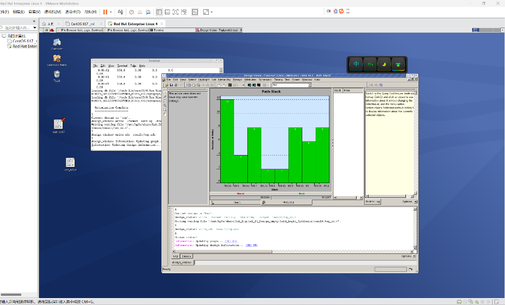

# Full-Flow Digital IC Design: From Verilog to GDSII
# 数字集成电路全流程设计：从 Verilog 到 GDSII

This repository showcases a complete digital ASIC design flow based on the **CSMC 0.5μm** process node. The project covers the entire implementation path from Verilog source code to physical layout verification.

本项目展示了基于 **上华 (CSMC) 0.5μm** 工艺节点的完整数字 ASIC 设计流程。涵盖了从 Verilog 源代码到物理版图验证的全过程实现。

---

## 👤 Author 信息
- **Name/姓名:** Keyu Li (李科瑜)
- **Supervised by/指导教师:** Jincheng Li (李金城)

---

## 🛠 EDA Tools & Tech Stack | 工具链与技术栈
| Phase / 阶段 | Tools / 工具 | Description / 描述 |
| :--- | :--- | :--- |
| **Logic Synthesis** | Synopsys Design Vision | RTL to Gate-level Netlist 逻辑综合 |
| **STA** | Synopsys PrimeTime | Timing Analysis & Verification 静态时序分析 |
| **P&R (Back-end)** | Cadence Encounter | Place and Route 自动布局布线 |
| **Physical Verification** | Cadence Virtuoso | DRC & LVS Check 物理验证 |
| **Process Node** | CSMC 0.5μm | Dual-Poly Three-Metal (DPTM) 工艺 |

---

## 🚀 Design Flow Overview | 设计流程概览

### 1. Logic Synthesis & Constraints (逻辑综合)
- **Module Structure:** `top.v` (Wrapper), `data_pro.v`, `data_sw.v`.
- **Target Frequency:** 10 MHz (Clock period = 100ns).
- **Result:** Converted RTL behavioral description into a technology-mapped gate-level netlist using specialized scripts.
- **结果:** 将 RTL 行为级描述转换为映射到工艺库的门级网表，通过脚本确保逻辑符合时序约束。
#### Synthesis Timing Report (Slack Analysis) | 综合时序报告

> *Figure 1: Timing slack check under Worst Case conditions, confirming setup time compliance.*

### 2. Static Timing Analysis (静态时序分析)
- Performed **Pre-layout STA** using PrimeTime with "Worst Case" library conditions.
- Validated setup and hold times to ensure zero violations before physical implementation.
- 使用 PrimeTime 在最差工况库下进行分析。验证建立时间和保持时间，确保在物理实现前无时序违例。

### 3. Automatic Place and Route (自动布局布线)
- Managed floorplanning, power ring/stripe routing, and standard cell placement in Encounter.
- Generated the physical netlist and DEF files for layout extraction.
- 在 Encounter 中完成规划布线、电源环路设置及标准单元布局。生成物理网表及相关 DEF 文件用于版图提取。

### 4. Physical Verification (物理验证)
- **DRC (Design Rule Check):** Fixed metal-to-via spacing violations by manually adjusting metal widths in Virtuoso.
- **LVS (Layout vs. Schematic):** Converted the Encounter netlist to CDL format using `v2lvs` scripts and achieved a match with the physical layout.
- **DRC (设计规则检查):** 手动修复了孔与金属间距不足的错误。
- **LVS (版图一致性检查):** 使用 `v2lvs` 脚本将网表转为 CDL 格式，最终版图与原理图完美匹配。

---

## 📈 Key Results | 关键结果
- [x] **Timing Closure:** All paths achieved positive slack. (时序收敛)
- [x] **DRC Clean:** Passed all design rules. (通过物理规则检查)
- [x] **LVS Clean:** Layout perfectly matches the netlist. (通过一致性检查)

## 📝 Reflections | 实验心得
Successfully navigated the complex ASIC design cycle. Key challenges addressed included script path debugging and resolving geometry violations during the DRC phase, deepening my understanding of the relationship between logical gates and physical silicon.
成功实践了复杂的 ASIC 设计周期。解决了脚本路径调试及 DRC 阶段的几何违例问题，加深了对逻辑门与物理硅片之间映射关系的理解。

---
*Last updated: 2024-10-31*
